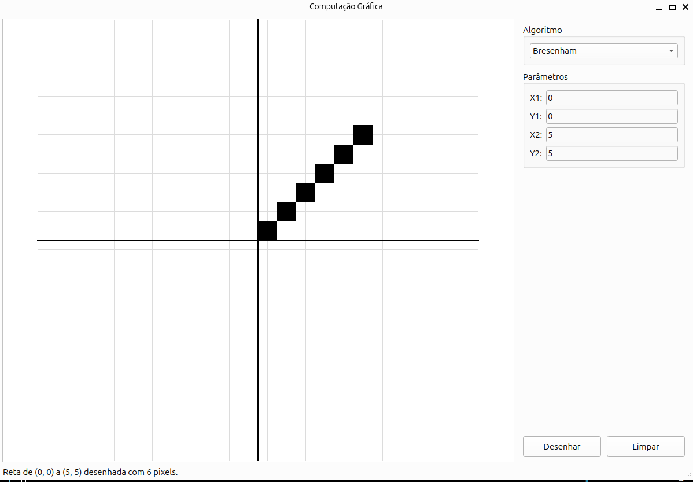

# Algoritmos de Computação Gráfica

Aplicação desktop em Python/PySide6 que implementa e visualiza, de forma interativa, os principais algoritmos de rasterização, recorte, transformação e projeção estudados em Computação Gráfica — permitindo desenhar retas, curvas, polígonos e sólidos 3D pixel a pixel em um canvas 2D.




## Status do Projeto

> Projeto acadêmico desenvolvido para a disciplina de Computação Gráfica. Os algoritmos principais já estão implementados e funcionais; novas melhorias podem ser adicionadas em trabalho futuros.

## Funcionalidades

O sistema oferece uma interface gráfica (canvas + painel de controles) onde é possível escolher um algoritmo, informar seus parâmetros e visualizar o resultado desenhado pixel a pixel:

- **Bresenham** — desenha uma reta pixel a pixel.
- **Círculo** — desenha um círculo com o algoritmo do ponto médio.
- **Elipse** — igual ao círculo, mas com raios diferentes em X e Y.
- **Curva de Bézier** — curvas suaves, quadrática ou cúbica, mexendo nos pontos de controle.
- **Polilinha** — liga vários pontos em sequência, aberta ou fechada.
- **Preenchimento de polígonos** — pinta o interior de uma forma (flood fill ou scanline).
- **Recorte de Linhas** — corta o que fica fora de uma janela, usando Cohen-Sutherland.
- **Recorte de Polígonos** — mesma ideia, mas pra polígonos, usando Sutherland-Hodgman.
- **Transformações Geométricas 2D** — move, escala ou gira uma forma, com controle de pivô e ponto fixo.
- **Projeções de sólidos 3D** — projeta um sólido 3D (tem um cubo pronto pra testar) em ortográfica, oblíqua ou perspectiva.

Recursos gerais da interface:
- Canvas com grade, eixos coordenados e sistema de coordenadas centrado na origem.
- Barra de status com feedback textual do resultado de cada operação (nº de pixels, vértices, erros de validação, etc.).
- Botão para limpar o canvas a qualquer momento.

## Pré-requisitos

Antes de rodar o projeto, você precisa ter instalado:

- **Python 3.10 ou superior**
- **pip** (gerenciador de pacotes do Python)
- Git (para clonar o repositório)

As dependências Python do projeto (instaladas via `requirements.txt`) são:

| Pacote | Versão |
|---|---|
| numpy | 2.5.1 |
| pillow | 12.3.0 |
| PySide6 | 6.11.1 |
| PySide6_Addons | 6.11.1 |
| PySide6_Essentials | 6.11.1 |
| shiboken6 | 6.11.1 |

## Como Instalar e Rodar

```bash
# 1. Clone o repositório
git clone https://github.com/<seu-usuario>/Algoritmos_Computacao_Grafica.git
cd Algoritmos_Computacao_Grafica

# 2. Crie e ative um ambiente virtual (recomendado)
python -m venv .venv

# Linux/macOS
source .venv/bin/activate

# Windows
.venv\Scripts\activate

# 3. Instale as dependências
pip install -r requirements.txt

# 4. Execute a aplicação
python main.py
```

## Como Usar

1. Ao abrir a aplicação, escolha um algoritmo no menu suspenso **"Algoritmo"**, no painel lateral direito.
2. Preencha os campos de parâmetros que aparecem (eles mudam dinamicamente conforme o algoritmo escolhido).
3. Clique em **"Desenhar"** para rasterizar o resultado no canvas.
4. Clique em **"Limpar"** para apagar o canvas e recomeçar.

**Exemplos práticos:**

- **Reta de Bresenham:** selecione "Bresenham", informe X1=`-5`, Y1=`-3`, X2=`5`, Y2=`4` e clique em Desenhar.
- **Recorte de Linhas:** selecione "Recorte de Linhas", informe uma linha maior que a janela (ex: X1=`-8`, Y1=`-2`, X2=`8`, Y2=`6`) e uma janela menor (Xmin=`-4`, Ymin=`-3`, Xmax=`4`, Ymax=`4`) — a parte fora da janela azul é recortada.
- **Transformações Geométricas:** adicione os vértices de um polígono na lista, escolha "Rotação", informe um ângulo e um pivô, e veja o polígono original (cinza) e o transformado (vermelho) lado a lado.
- **Projeções 3D:** selecione "Projeções", clique em **"Usar cubo de exemplo"** para carregar automaticamente os 8 vértices e 12 arestas de um cubo, escolha o tipo de projeção (Ortográfica, Oblíqua ou Perspectiva) e clique em Desenhar.

## Estrutura do Projeto

```
Algoritmos_Computacao_Grafica/
├── algoritmos/              
│   ├── bresenham.py
│   ├── circulo.py
│   ├── curvas_de_bezier.py
│   ├── elipse.py
│   ├── polilinha.py
│   ├── preenchimento.py
│   ├── projecoes.py
│   ├── recorte_linhas.py
│   ├── recorte_poligono.py
│   └── transformacoes_geometricas.py
├── ui/                       # Interface gráfica (PySide6)
│   ├── canvas_widget.py       
│   ├── main_window.py         
│   └── painel_controles.py    
├── docs/                     
├── main.py                  
└── requirements.txt           
```

A separação segue o princípio de responsabilidade única: `algoritmos/` contém apenas a lógica matemática (testável isoladamente, sem depender do Qt), enquanto `ui/` cuida exclusivamente da interface e da interação com o usuário.


## Licença

Este projeto está licenciado sob os termos da **licença MIT**.